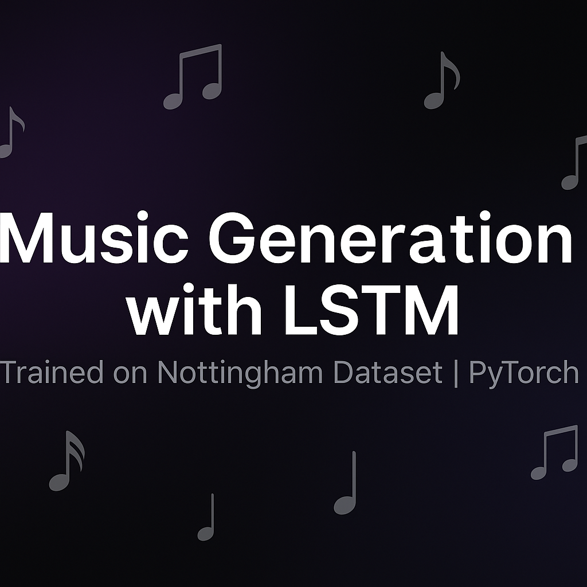

<p align="center">
  
</p>
# 🎶 Music Generation with LSTM (Nottingham Dataset)

This project implements an **LSTM-based symbolic music generation system** trained on the [Nottingham Music Dataset](https://www.kaggle.com/datasets/eftimiepetre/nottingham-music).  
It demonstrates an end-to-end workflow: **data preparation → model training → evaluation → autoregressive music generation → MIDI export**.  
The final system generates polyphonic piano-roll sequences and exports them as MIDI files for playback in DAWs or sheet-music editors like MuseScore.

---

## 📂 Project Structure
```
music-generation-lstm/
├── data/                  # Dataset folder (ignored, see data/README.md for download)
│   └── README.md          # Instructions to download Nottingham.mat
├── models/                # Saved weights
│   └── lstm_nottingham.pt # Pretrained model (~2.9 MB included for demo)
├── notebooks/             # Kaggle/Colab experiments
├── samples/               # Demo outputs (kept small)
│   ├── lstm_sample.mid    # Example generated music
│   ├── evaluation.png     # Pitch histogram plot
│   └── train_val_loss.png     # Training/validation loss curve
├── src/                   # Core source code
│   ├── dataset.py         # .mat → piano-roll preprocessing, Dataset/DataLoader
│   ├── model.py           # MusicLSTM definition
│   ├── train.py           # Training loop (AMP, clipping, early stopping)
│   ├── generate.py        # Autoregressive generation + MIDI export
│   ├── evaluate.py        # Quantitative checks (metrics, density, pitch histogram)
│   └── utils.py           # Precision/Recall, density, histogram helpers
├── .gitignore             # Ignore data/, temp samples, extra weights
├── requirements.txt       # Python dependencies
└── README.md              # Project documentation
```

---

## ⚙️ Installation
Clone and install dependencies:
```bash
git clone https://github.com/your-username/music-generation-lstm.git
cd music-generation-lstm
pip install -r requirements.txt
```

Requirements:
- Python ≥ 3.9  
- PyTorch ≥ 2.1 (with CUDA for GPU acceleration)  

---

## 📊 Dataset
We do **not** include the full Nottingham dataset in this repo (too large).  
Instead, download the `.mat` file from Kaggle and place it under `data/`:

```
data/Nottingham.mat
```

See `data/README.md` for detailed instructions.

---

## 🚀 Usage

### 1. Train the model
```bash
python -m src.train --data data/Nottingham.mat --epochs 20 --seq-len 128 --batch-size 32 --lr 1e-5 --save models/lstm_nottingham.pt
```

### 2. Generate music
```bash
python -m src.generate --weights models/lstm_nottingham.pt --data data/Nottingham.mat --seed-index 0 --seed-len 192 --steps 512 --temperature 1.0 --threshold 0.5 --out samples/lstm_sample.mid
```

This creates a `.mid` file playable in **MuseScore**, **FL Studio**, or any DAW.

### 3. Evaluate the model
```bash
python -m src.evaluate --weights models/lstm_nottingham.pt --data data/Nottingham.mat --seq-len 128 --batch-size 32 --seed-index 0 --seed-len 192 --steps 512 --temperature 1.0 --threshold 0.50 --plot samples/evaluation.png
```

You’ll get:
- **Precision / Recall / F1** on validation  
- **Note density** (real vs generated)  
- **Pitch histogram plot** (`samples/evaluation.png`)  

---

## 📈 Example Results
- Best validation loss ≈ **0.25** after 20 epochs (on Kaggle GPU).  
- **F1-score ~0.56** at threshold 0.5.  
- Generated samples sound musically coherent but slightly denser (tend to over-predict notes).  

See included demo files in `samples/`:  
- 🎵 `lstm_sample.mid` → Generated music example  
- 📊 `evaluation.png` → Pitch distribution comparison  
- 📉 `train_val_loss_.png` → Training/validation loss curve /  

---

## 🛠️ Key Features
- End-to-end pipeline (data → training → generation → evaluation).  
- Reproducible with CLI scripts.  
- GPU-accelerated training (AMP, gradient clipping, early stopping).  
- Quantitative + qualitative evaluation (metrics + MIDI + plots).  
- One pretrained LSTM model (`models/lstm_nottingham.pt`) and demo outputs included.  

---

## 📌 Next Steps
- Experiment with **Transformer-based architectures** for comparison.  
- Tune thresholds, temperature, and sequence length.  
- Fine-tune on custom MIDI datasets.  

---

## 📜 License
MIT License.  Feel free to use, modify, and build upon this project.

---